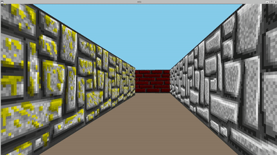

# cub3D - 3D Raycasting Engine

<div align="center">


*A Wolfenstein 3D-inspired raycasting engine built from scratch in C*

</div>

---

## 📖 About

**cub3D** is a 3D graphics project that recreates the fundamental raycasting techniques used in early 3D games like Wolfenstein 3D. This project demonstrates real-time 3D rendering using 2D raycasting algorithms, creating an immersive first-person perspective within a maze-like environment.

Built as part of the 42 school curriculum, this project emphasizes low-level graphics programming, mathematical precision, and performance optimization without relying on modern 3D graphics APIs.

## 🎮 Demo

<div align="center">
  
  <p><em>Navigate through textured 3D maze environments with smooth AZERTY controls</br>(we swear the low framerate is due to the GIF format :p )</em></p>
</div>

## ✨ Features

### Core Functionality
- **Real-time 3D rendering** using raycasting algorithms
- **Textured walls** with XPM sprite support
- **Smooth player movement** with collision detection
- **Camera rotation** for full 360° exploration
- **Configurable environments** via `.cub` map files

### Controls (AZERTY Layout)
- **Z/S**: Move forward/backward
- **Q/D**: Strafe left/right  
- **A/E**: Rotate camera left/right
- **Arrow Keys**: Alternative movement/rotation
- **ESC**: Exit

### Technical Features
- **Double buffering** for flicker-free rendering
- **DDA algorithm** for efficient ray-wall intersection
- **Texture mapping** with proper wall distance calculations
- **Color-coded floors and ceilings**
- **Memory-safe** implementation with proper cleanup

## 🛠️ Technical Implementation

### Raycasting Algorithm

The heart of cub3D lies in its **raycasting engine**, which creates a 3D perspective from a 2D map:

1. **Ray Projection**: For each screen column, cast a ray from the player's position
2. **DDA Traversal**: Use Digital Differential Analyzer to efficiently step through grid cells
3. **Wall Detection**: Identify the first wall intersection and calculate distance
4. **Height Calculation**: Project wall height based on distance (closer = taller)
5. **Texture Mapping**: Map the correct texture column to screen pixels

```
Player Position → Ray Direction → Wall Hit → Screen Projection
     (x,y)           (angle)        (dist)       (height)
```

### Architecture

```
cub3D/
├── srcs/           # Core engine implementation
│   ├── parsing/    # Map and configuration parser (pa_*.c)
│   ├── exec/       # Raycasting engine (exec*.c)
│   └── movement/   # Player controls (movement_*.c)
├── incs/           # Headers and constants
├── maps/           # Demo levels (.cub format)
├── textures/       # Wall textures (XPM format)
└── libs/           # Libraries (libft, MLX)
```

### Performance Optimizations
- **Efficient ray casting** using DDA instead of brute-force intersection
- **Texture caching** to avoid repeated file I/O
- **Integer arithmetic** where possible for speed
- **Minimal system calls** in the rendering loop

## 🚀 Quick Start

### Prerequisites
```bash
# Ubuntu/Debian
sudo apt-get update
sudo apt-get install gcc make libxext-dev libbsd-dev

# The project includes MLX library - no additional installation needed
```

### Build & Run
```bash
# Clone the repository
git clone https://github.com/lgeniaux/cub4d.git
cd cub4d

# Compile the project
make

# Launch with demo map
./cub3D maps/demo.cub
```

### Map Format
Create custom levels using the `.cub` format:
```
NO ./textures/north_wall.xpm
SO ./textures/south_wall.xpm
EA ./textures/east_wall.xpm
WE ./textures/west_wall.xpm
F 139,119,101
C 135,206,235

1111111111
1000000001
10000N0001
1000000001
1111111111
```

## 📁 Project Structure

| Component | Description | Files |
|-----------|-------------|-------|
| **Parser** | `.cub` file parsing and validation | `pa_*.c` (12 files) |
| **Engine** | Core raycasting and rendering | `exec*.c` (4 files) |
| **Controls** | Player movement and camera | `movement_*.c` (3 files) |
| **Utils** | Helper functions and utilities | Various |

**Total**: ~1,840 lines of C code across 21 source files

## 🎯 Key Learning Outcomes

- **3D Graphics Mathematics**: Vector operations, trigonometry, projection
- **Algorithm Implementation**: DDA, raycasting, texture mapping
- **Performance Optimization**: Real-time rendering constraints
- **Memory Management**: Proper allocation/deallocation in C
- **Graphics Programming**: Double buffering, event handling
- **File Parsing**: Custom format parsing and validation

## 🏗️ Development Notes

### Compilation
The project uses a custom Makefile with dependency management:
- Automatic library compilation (libft, MLX)
- Comprehensive cleaning targets
- Optimized compilation flags (`-O3`)

### Standards Compliance
- **42 Norminette**: Strict coding standards compliance
- **Memory Safety**: No leaks, proper error handling


---

<div align="center">
  <strong>Built with passion for low-level graphics programming</strong><br>
  <em>42 School • Advanced C Programming • Computer Graphics</em>
</div>